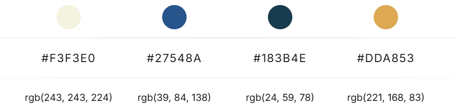
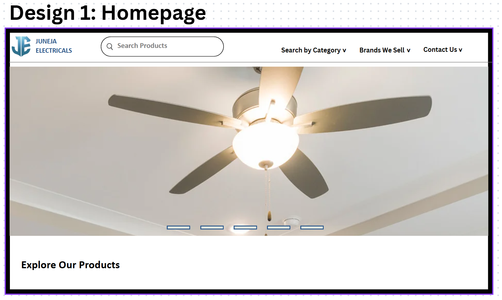

# JUNEJA ELECTRICALS
This project is driven by the need to modernize our family’s electrical appliances business, which currently relies on offline customer interactions and word-of-mouth referrals. As the world moves more online, having a digital presence is essential for attracting new customers, building trust, and staying competitive. Creating a professional, user-friendly website will not only showcase our products and services more effectively but also streamline customer inquiries and improve accessibility

## Goals and Purpose
- Improve online visibility and attract more customers.
- Create a professional online portfolio for the business.

## Features
- Explore various products with wide range of variety.
- Reach out the owner for any query.
- Locate the shop using Google Map.

## Tech Stack
- **Frontend:** HTML, CSS (Tailwind CSS)
- **Version Control:**  Git (2.46.2.windows.1), GitHub
- **Deployment:** GitHub Pages

## Development Tools
- **Visual Studio Code (1.100.2)** - For coding and project management
- **Canva** - For sketching wireframes and planning layouts

## Designs
- **Colors:** Colors we used primarily, are: 
- **Design 1:** 
- **Design 2:** 
- **Design 3:** 
- **Design 4:** 
- **Design 5:** 
- **Design 6:** 
- **Design 7:** 
- **Design 8:** 
- **Design 9:** 
- **Design 10:** 
- **Design 11:** 
- **Design 12:** 
- **Design 13:** 
- **Design 14:** 

## Timeline & Progress
**Started on:** May 29th, 2025 
- **Week 1:**
    - Created repository (public) on GitHub.
    - Created home page designs (design 1) using Canva.
    - Created navbar items hovering designs (design 2, 3, 4) using Canva.
    - Created a products section (design 5), owner section (design 6), contact us section (design 7), and footer section (design 8) for the homepage.
    - Created responsive navbar for homepage.

- **Week 2:**
    - Created Explore our Products section, Meet the Owner section, Contact us Section and Footer Section.
    - Made the sections responsive.
    - Designed fans.html, switches-sockets.html, pvc-pipes.html, lightings.html, irons.html, wires.html.
    - Created hamburger menu. Responsive with transitions and toggling effects.

- **Week 3:**
    - Created Preloader.

## Future Scope
- Inventory system can be developed.
- Order & Billing section can be created before Payment.
- An Android application can be developed.
- An iOS application can be developed.

## Links & References
- **GitHub Repo link:** https://github.com/KashishJuneja101003/Juneja-Electricals
- **Deployment link (GitHub):** https://kashishjuneja101003.github.io/Juneja-Electricals/
- **Deployment link (Netlify):** https://junejaelectricals.netlify.app/
